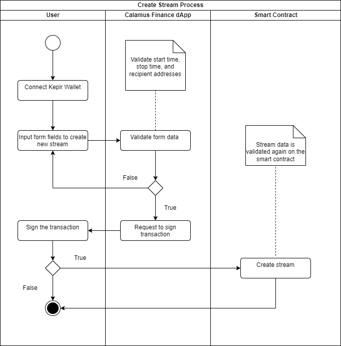
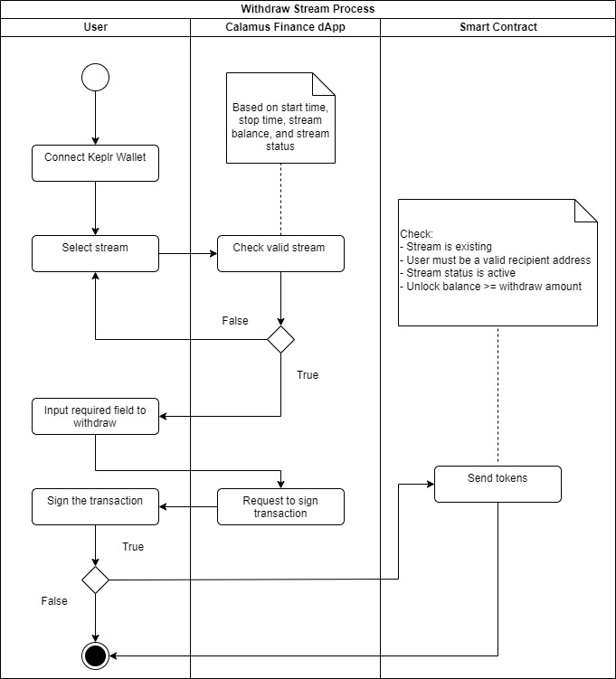
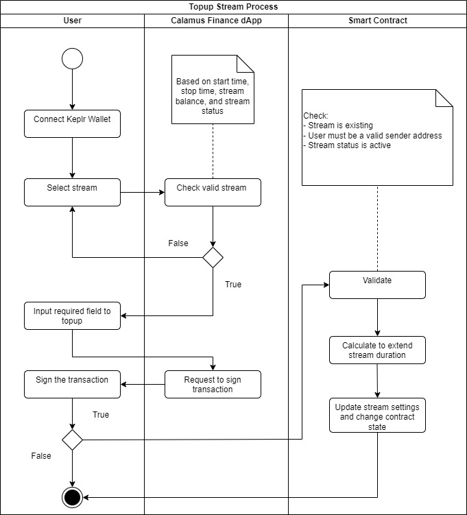
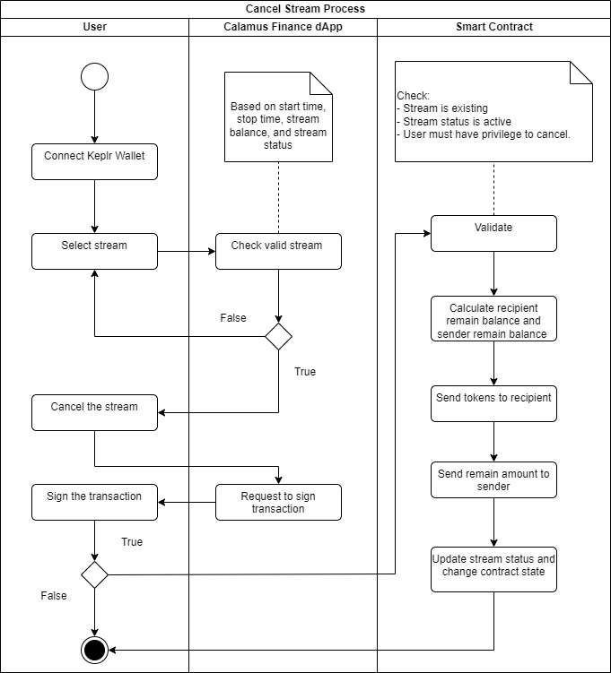
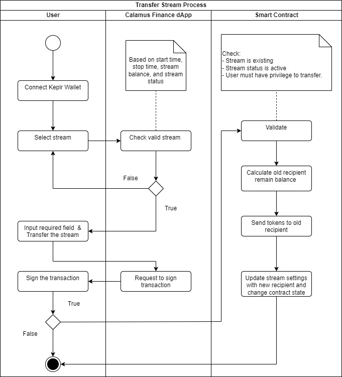

# Crypto streaming on Injective chain
Calamus Finance is a protocol for streaming cryptocurrency that operates in a decentralized manner, enabling individuals to make payments and receive them at any given time, while also facilitating automatic token vesting.

The reason for selecting Injective is its all-encompassing nature within the Cosmos Ecosystem, which enables us to save time on research and development and concentrate more on feature development.

# Main Features
- **Payroll**: Pay your employees by the second quickly. Company will have complete control over frequency, liquidity amount and duration. Cancellation is possible at any time by the payer and/or payee.
- **Token Vesting**: Reward your team, advisors and investors with tokens automatically without any fear of foul-play

# Technologies
- **CosmWasm**: To develop smart contracts
- InjectiveLabs SDK
- InjectiveLabs Wallet API
- [Injectived](https://docs.injective.network/develop/tools/injectived/install) Dev tool
- NextJS 12
- Charka UI components
- React 17 & React-Redux

# Installation

Prior to beginning, it is necessary to install [Rust](https://www.rust-lang.org/tools/install) and [NodeJS](https://nodejs.org/ro).

### Deploy smart contracts
#### Install tools
- Install [Injectived](https://docs.injective.network/develop/tools/injectived/install)
- Add new address or import keys using two commands: 
  - `injectived keys add`
  - `injectived keys import`

#### Deployment

- CD to contract folder: `cd contracts/`
- Compile contract
    ```
    docker run --rm -v "$(pwd)":/code \
      --mount type=volume,source="$(basename "$(pwd)")_cache",target=/code/target \
      --mount type=volume,source=registry_cache,target=/usr/local/cargo/registry \
      cosmwasm/rust-optimizer:0.12.12
    
    ```
- Upload wasm code
    ```
    INJ_ADDRESS=<your_inj_address>
    
    injectived tx wasm store artifacts/inject_cash.wasm \
    --from=$(echo $INJ_ADDRESS) \
    --chain-id="injective-888" \
    --yes --gas-prices=500000000inj --gas=20000000 \
    --node=https://k8s.testnet.tm.injective.network:443
    
    ```
- Query last tx
  ```
  injectived query tx <your_tx_hash>  --node=https://k8s.testnet.tm.injective.network:443
  ```
- Check events and get code_id from log, our code_id in Testnet is 862
    ```
    - events:
     - attributes:
       - key: access_config
         value: '{"permission":"Everybody","address":"","addresses":[]}'
       - key: checksum
         value: '"cfAswcayj/XJRHiV0Y3/hejWQZ70ymhgY9QWjez8plU="'
       - key: code_id
         value: '"514"'
       - key: creator
         value: '"inj1gwpnskafpjn4dg5uarh6cc5s68gv86589zcfxp"'
    
    ```
    ```
    export CODE_ID=<code_id>
    ```
- Get contract address
    ```
    CONTRACT=$(injectived query wasm list-contract-by-code $CODE_ID --node=https://k8s.testnet.tm.injective.network:443 --output json | jq -r '.contracts[-1]')
    ```
    ```
    injectived query wasm contract $CONTRACT --node=https://k8s.testnet.tm.injective.network:443
    ```
### Install dApp

- Run command: `npm i`
- Run dev mode: `npm run dev`
- Run production mode: `npm run start`

# Smart Contracts
Our main smart contract is [here](https://testnet.explorer.injective.network/contract/inj1tna3283sjqd4vdehglz9r8hgswel3jl6vx8q4a/?tab=transactions)

### Create stream process


### Withdraw token process



### Top-up stream process 


### Cancel stream process


### Transfer stream process


# Testing
- CD to contract folder: `cd contracts/`
- Run command: `cargo test`
# License

Copyright © 2023 Shopify. See [LICENSE](LICENSE.md) for further details.