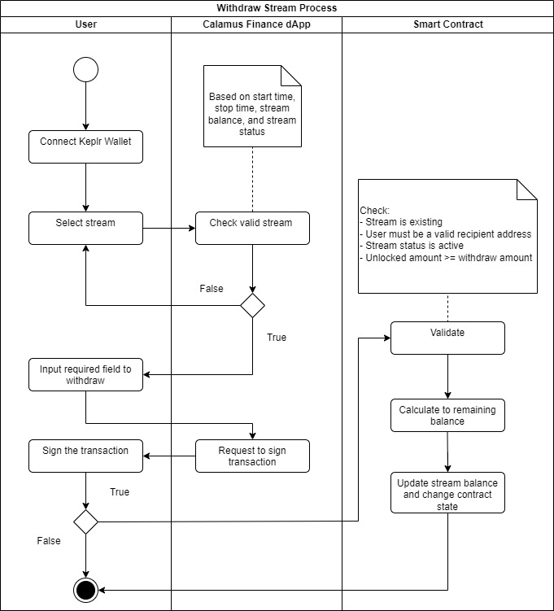

# Crypto streaming on Injective chain
Calamus Finance is a protocol for streaming cryptocurrency that operates in a decentralized manner, enabling individuals to make payments and receive them at any given time, while also facilitating automatic token vesting.

The reason for selecting Injective is its all-encompassing nature within the Cosmos Ecosystem, which enables us to save time on research and development and concentrate more on feature development.

# Main Features
- **Payroll**: Pay your employees by the second quickly. Company will have complete control over frequency, liquidity amount and duration. Cancellation is possible at any time by the payer and/or payee.
- **Token Vesting**: Reward your team, advisors and investors with tokens automatically without any fear of foul-play

# Technologies
- **CosmWasm**: To develop smart contracts
- InjectiveLabs SDK
- InjectiveLabs Wallet API
- NextJS 12
- Charka UI components
- React 17 & React-Redux

# Installation

Prior to beginning, it is necessary to install [Rust](https://www.rust-lang.org/tools/install) and [NodeJS](https://nodejs.org/ro).

### Deploy smart contracts

### Install dApp

- Run command: `npm i`
- Run dev mode: `npm run dev`
- Run production mode: `npm run start`

# Smart Contracts
Our main smart contract is [here](https://testnet.explorer.injective.network/contract/inj1tna3283sjqd4vdehglz9r8hgswel3jl6vx8q4a/?tab=transactions)

### Create stream process

### Withdraw token process

### Top-up process 

### Cancel

### Transfer

# Testing

# License

Copyright © 2023 Shopify. See [LICENSE](LICENSE.md) for further details.